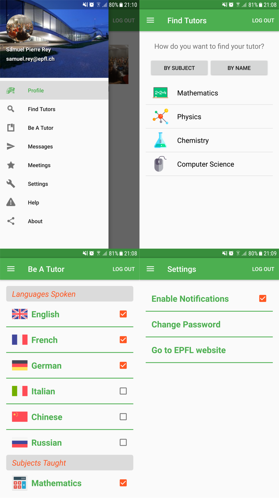
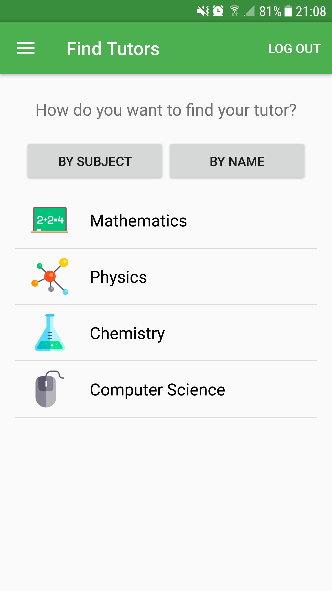

# Software-Engeenering-Tutosaurus

Collaborators:
 * [ubervison](https://github.com/ubervison)
 * [santogioia](https://github.com/santogioia)
 * [albertochiappa](https://github.com/albertochiappa)
 * Vincent Rinaldi
 * [BlaBlaEP](https://github.com/BlaBlaEP)
 * [S-Rey](https://github.com/BlaBlaEP)
 

### Synopsis
This repository contains all the code of the project of the Software Engeenreing classe givent at [EPFL](http://www.epfl.ch).

The purpose of the Tutosaurus application was to put in contact students researching teacher students
and strudents wanting to teach them.
The user can choose in which fields he/she wants to give lessons and/or in which fileds he/she 
wants to have a teacher.
After that, the user is put in conatc with some potential students/teachers and can discuss with the 
integrated chat app and set up a meeting that will directly be added to their calendar.
Also after the meeting, the student and the teacher student can rate each other out of five stars.

### Screenshots

